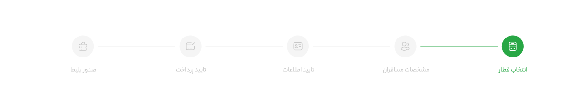

# Step Progressbar

A clean and simple horizontal step progress bar with custom SVG icons, designed for Persian (RTL) layouts.

&nbsp;

### 📸 Preview

&nbsp;

## Features
- Multi-step progress indicator with icons and labels
- Highlights completed steps with green color for clear visual feedback
- Custom SVG icons embedded for sharp visuals
- Supports right-to-left (RTL) direction for Persian language

&nbsp;

## Usage
1. Include the HTML structure with `.step` elements inside the `.container`.
2. Add the `.step--complete` class to completed steps to highlight them.
3. Customize icons by editing or adding SVG symbols inside the `<svg class="icon-pack">`.
4. Link the provided CSS to style the progress bar and load Persian fonts.

&nbsp;

## 📬 Contact

  
  
  

&nbsp;

## Feedback & Contribution
If you like this project, please ⭐ star it!  
Feel free to open issues or submit pull requests for improvements.